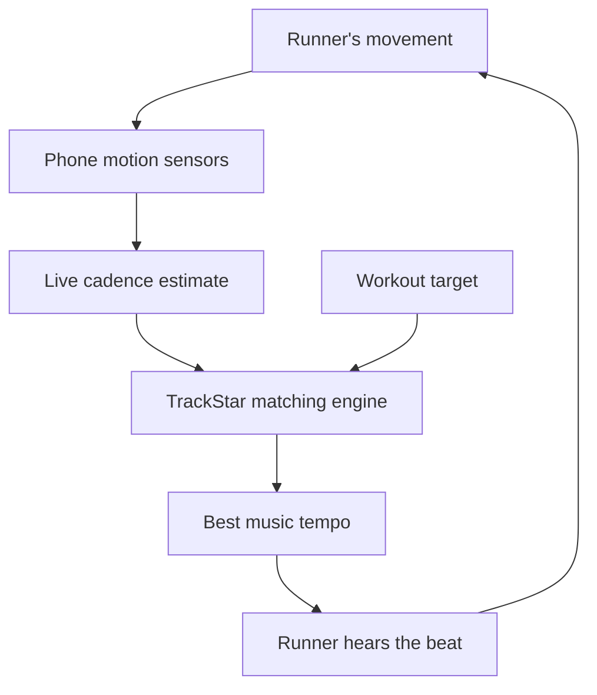
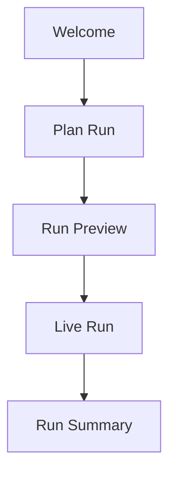
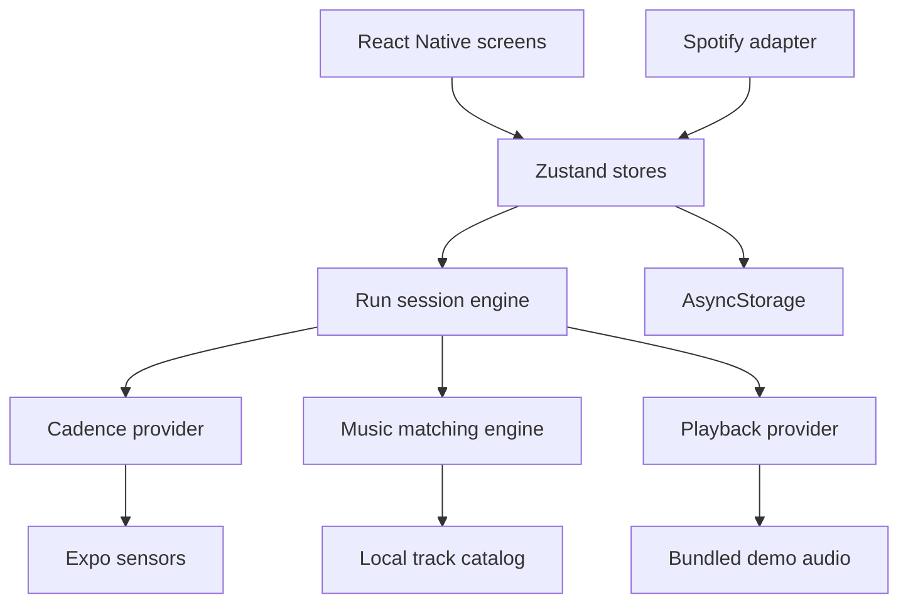
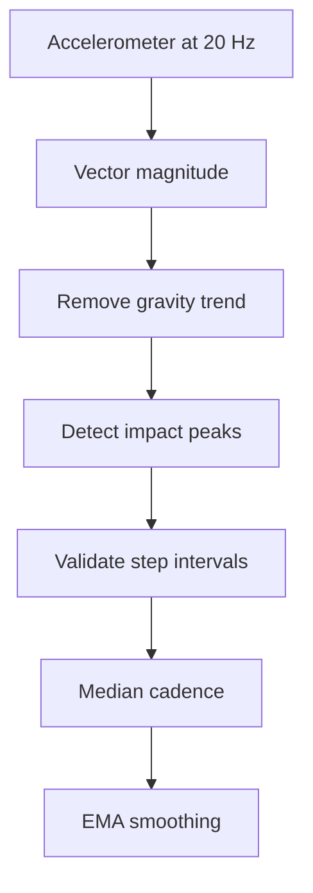
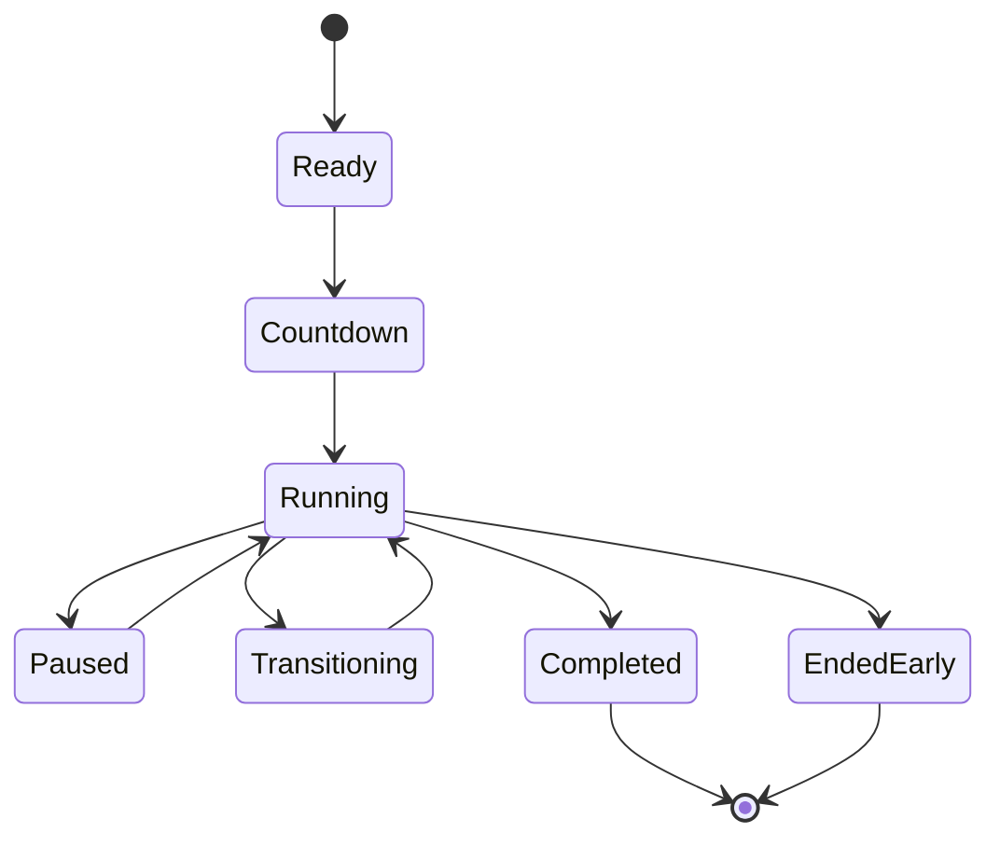

I finalized the product around one clear idea: **TrackStar is a closed-loop cadence coach that uses music to guide a runner toward their target pace.**

I couldn’t make the downloadable file available in this run, so below is the complete copy-ready content for `TRACKSTAR_BUILD_SPEC.md`.

---

# TrackStar — Product and Engineering Specification

> **Tagline:** Every step. On beat.
> **Platform:** React Native with Expo and TypeScript
> **Hackathon category:** Health + Music
> **Document status:** Build-ready MVP specification
> **Last updated:** September 14, 2026

---

## 1. Product Summary

TrackStar is a real-time running cadence coach that adapts music to the runner’s actual movement.

The runner creates a workout with target steps per minute, or SPM. During the workout, TrackStar measures their live cadence using the phone’s motion sensors, compares it with the current workout target, and chooses music that gently guides them toward the correct rhythm.

TrackStar is not simply a BPM playlist generator.

It creates a feedback loop:



### One-sentence pitch

> TrackStar measures how fast you are actually stepping and uses music to keep you on pace.

### Judge-friendly explanation

> Spotify knows what music you like. TrackStar knows how your body is moving right now.

---

## 2. The Problem

Running playlists normally have a fixed energy or tempo. They do not know whether the runner is:

* Falling behind their target cadence
* Running too fast
* Starting a sprint interval
* Entering recovery
* Maintaining a consistent rhythm
* Struggling to follow the planned workout

Traditional fitness applications show pace and cadence, but runners often need to look at a screen or watch.

TrackStar turns the music itself into the coaching interface.

When the workout changes, the soundtrack changes. When the runner’s cadence drifts, the music responds.

---

## 3. Product Differentiation

TrackStar should not be presented as “Spotify playlists based on BPM.”

Its real product category is:

> **Adaptive music-powered running coach**

| Typical music feature           | TrackStar                                   |
| ------------------------------- | ------------------------------------------- |
| User manually selects a BPM     | Measures actual live cadence                |
| Generates a fixed playlist      | Continuously evaluates cadence              |
| Music-first experience          | Running-performance-first experience        |
| Preset workout only             | Tracks interval adherence                   |
| No physical feedback loop       | Music responds to the runner                |
| Shows listening history         | Shows cadence and beat-match analytics      |
| Requires a perfect song catalog | Supports direct-time and half-time matching |

### Core differentiator

If the workout target is 170 SPM but the runner is currently at 160 SPM, TrackStar does not immediately force 170 BPM music.

It can first choose music around 164–166 BPM and progressively guide the runner upward.

This makes TrackStar feel like a coach instead of a playlist filter.

---

## 4. Target User

The initial user is a casual or intermediate runner who:

* Runs with their phone and headphones
* Already listens to music while running
* Wants to improve cadence consistency
* Uses interval workouts
* Does not want to constantly check a watch
* Cares more about rhythm and motivation than advanced professional metrics

The hackathon prototype does not need to serve professional athletes.

---

## 5. Product Principles

### 5.1 Music is the interface

The runner should feel workout transitions through the soundtrack without needing to look at the phone.

### 5.2 Adapt gradually

One unusual step or sensor reading must not immediately change the song.

### 5.3 The run must work offline

The live cadence engine, interval timer, demo music and analytics should not require an internet connection.

### 5.4 Spotify is optional

A Spotify failure must not prevent the core TrackStar demonstration.

### 5.5 Never claim medical accuracy

TrackStar is a fitness and motivational tool, not a medical device.

---

## 6. Hackathon MVP

The complete MVP consists of one polished user journey:

1. Open TrackStar
2. Enter height or complete a short cadence calibration
3. Select music genres
4. Build an interval workout
5. Generate a matching soundtrack
6. Start the run
7. Detect live cadence
8. Adapt the soundtrack when cadence changes
9. Complete the workout
10. Display TrackStar-specific analytics

### Required features

| Feature            | MVP requirement                              |
| ------------------ | -------------------------------------------- |
| Workout builder    | Multiple timed cadence intervals             |
| Cadence estimation | Accelerometer-based live SPM                 |
| Matching engine    | Direct-time and half-time BPM matching       |
| Adaptive coaching  | Music target reacts gradually                |
| Demo playback      | Bundled audio tracks through `expo-audio`    |
| Live run UI        | Target, actual SPM, song BPM and match score |
| Analytics          | Cadence timeline and adherence metrics       |
| Demo mode          | Repeatable simulated cadence control         |
| Local persistence  | Save profile, workouts and run summaries     |

### Optional if time remains

* Spotify login
* Create a Spotify playlist
* Retrieve the user’s top tracks
* GPS distance and pace
* Native iOS `CMPedometer` adapter
* HealthKit or Health Connect export
* Spotify remote playback

### Explicitly out of scope

* Training an AI model
* A social network
* A production backend
* Apple Watch or Wear OS applications
* Automatic BPM extraction from Spotify
* Audio time-stretching
* Medical recommendations
* User accounts outside Spotify
* Full cross-platform background workout tracking

---

## 7. User Experience

TrackStar should contain five main screens.



---

## 8. Screen Specifications

### 8.1 Welcome and Setup

Purpose:

* Explain TrackStar in one sentence
* Request motion permission
* Collect height
* Offer Spotify connection
* Allow the user to continue without Spotify

Content:

* TrackStar logo
* “Every step. On beat.”
* Height input
* Preferred unit
* Genre selection
* Connect Spotify button
* Continue with Demo Music button

Spotify must never block the Continue button.

---

### 8.2 Plan Run

The runner builds an interval workout.

Each segment contains:

* Segment name
* Duration
* Target cadence
* Segment type
* Optional genre preference

Default workout:

| Segment  |   Duration |  Target |
| -------- | ---------: | ------: |
| Warm Up  |   1 minute | 145 SPM |
| Run      |  2 minutes | 165 SPM |
| Sprint   | 30 seconds | 178 SPM |
| Recovery |   1 minute | 145 SPM |

For a short judge demonstration, automatically compress the workout into 15–20 second intervals.

Controls:

* Add interval
* Delete interval
* Reorder interval
* Edit duration
* Edit target SPM
* Estimate from speed
* Start run

---

### 8.3 Run Preview

Display:

* Total workout duration
* Selected genres
* Interval timeline
* Estimated song count
* Direct-time and half-time track matches
* Spotify export option
* Start Run button

Example:

| Time      | Workout  |  Target |              Music range |
| --------- | -------- | ------: | -----------------------: |
| 0:00–1:00 | Warm Up  | 145 SPM | 139–151 BPM or 70–76 BPM |
| 1:00–3:00 | Run      | 165 SPM | 159–171 BPM or 80–86 BPM |
| 3:00–3:30 | Sprint   | 178 SPM | 172–184 BPM or 86–92 BPM |
| 3:30–4:30 | Recovery | 145 SPM | 139–151 BPM or 70–76 BPM |

---

### 8.4 Live Run

This is the most important screen.

The interface should be readable while moving.

Display:

* Current actual cadence
* Current target cadence
* Current effective song BPM
* Beat Match score
* Current interval
* Time remaining
* Next interval
* Song artwork
* Pause
* Skip
* End Run

Example:

```text
RUN

        164
      ACTUAL SPM

TARGET 170             MATCH 94%

Now: Tempo Run
Next: Sprint in 01:24

Playing
Night Drive
165 effective BPM

[ PAUSE ]       [ SKIP ]
```

The cadence number should animate when steps are detected.

Do not show a complex chart during the run.

---

### 8.5 Run Summary

Display:

* Average cadence
* Target cadence
* Beat Match score
* Cadence consistency
* Time within target
* Number of steps
* Interval completion
* Cadence timeline
* Song timeline

The primary graph overlays:

* Target cadence
* Actual cadence
* Effective song tempo

---

## 9. Visual Direction

### Theme

Minimal dark-mode interface inspired by a premium running watch.

### Color tokens

```ts
export const colors = {
  background: "#090B0A",
  surface: "#141714",
  surfaceRaised: "#1C201C",
  textPrimary: "#F7F9F6",
  textSecondary: "#969D96",
  accent: "#B8FF5A",
  accentMuted: "#6D9B34",
  warning: "#FFB84D",
  danger: "#FF5D5D",
  divider: "#292E29",
};
```

### Typography

* Large cadence: 72–96 px
* Screen title: 28–32 px
* Card heading: 16–18 px
* Supporting text: 13–15 px
* Use tabular numbers for timers and metrics

### Interaction rules

* Minimum touch target: 44×44 points
* High contrast
* No tiny buttons during a run
* Use color and text together
* Use haptic feedback for interval transitions
* Use subtle animation, not decorative clutter

---

## 10. System Architecture

The hackathon application should be local-first and use provider interfaces for anything platform-dependent.



### Core architectural decision

Business logic must not directly import:

* Expo sensors
* Spotify APIs
* Audio playback libraries
* Native health APIs

Instead, it communicates through interfaces.

This makes the application testable and allows the hackathon demo to switch between real and simulated providers.

---

## 11. Provider Interfaces

### Cadence provider

```ts
export interface CadenceSample {
  timestampMs: number;
  rawSpm: number | null;
  smoothedSpm: number | null;
  confidence: number;
  source: "accelerometer" | "ios-pedometer" | "android-step" | "simulation";
}

export interface CadenceProvider {
  requestPermission(): Promise<boolean>;
  isAvailable(): Promise<boolean>;
  start(onSample: (sample: CadenceSample) => void): Promise<void>;
  stop(): Promise<void>;
}
```

Implementations:

* `AccelerometerCadenceProvider`
* `SimulatedCadenceProvider`
* Future `IOSPedometerCadenceProvider`
* Future `AndroidStepCadenceProvider`

### Playback provider

```ts
export interface PlaybackTrack {
  id: string;
  title: string;
  artist: string;
  bpm: number;
  audioSource?: number | string;
  spotifyUri?: string;
}

export interface PlaybackProvider {
  load(track: PlaybackTrack): Promise<void>;
  play(): Promise<void>;
  pause(): Promise<void>;
  stop(): Promise<void>;
  seekToStart(): Promise<void>;
  getPositionMs(): Promise<number>;
}
```

Implementations:

* `DemoAudioPlaybackProvider`
* Future `SpotifyRemotePlaybackProvider`

### Music catalog provider

```ts
export interface MusicCatalogProvider {
  getCandidates(input: {
    genres: Genre[];
    targetSpm: number;
    excludedTrackIds: string[];
  }): Promise<Track[]>;
}
```

Implementations:

* `LocalCatalogProvider`
* Future `SpotifyCatalogProvider`
* Future licensed BPM catalog provider

---

## 12. Recommended Technology Stack

Use the latest compatible stable versions installed by Expo.

| Area                   | Technology                   |
| ---------------------- | ---------------------------- |
| Mobile framework       | React Native                 |
| Toolchain              | Expo                         |
| Language               | TypeScript                   |
| Navigation             | Expo Router                  |
| State                  | Zustand                      |
| Runtime validation     | Zod                          |
| Motion data            | `expo-sensors`               |
| Demo playback          | `expo-audio`                 |
| Spotify OAuth          | `expo-auth-session`          |
| Tokens                 | `expo-secure-store`          |
| Local application data | AsyncStorage                 |
| Charts                 | `react-native-svg`           |
| Haptics                | `expo-haptics`               |
| Unit testing           | Jest                         |
| Component testing      | React Native Testing Library |

Expo’s current documentation lists Expo Router as its file-based navigation system, `expo-sensors` for motion and pedometer access, and `expo-audio` for cross-platform playback. ([Expo documentation][1])

---

## 13. Project Structure

```text
trackstar/
├── app/
│   ├── _layout.tsx
│   ├── index.tsx
│   ├── onboarding.tsx
│   ├── plan.tsx
│   ├── preview.tsx
│   ├── run.tsx
│   └── summary.tsx
├── assets/
│   ├── audio/
│   ├── artwork/
│   └── icons/
├── src/
│   ├── components/
│   │   ├── Button.tsx
│   │   ├── MetricCard.tsx
│   │   ├── GenreChip.tsx
│   │   ├── IntervalCard.tsx
│   │   ├── IntervalTimeline.tsx
│   │   ├── CadenceGauge.tsx
│   │   ├── SongCard.tsx
│   │   └── RunChart.tsx
│   ├── constants/
│   │   ├── colors.ts
│   │   ├── layout.ts
│   │   └── defaults.ts
│   ├── data/
│   │   └── tracks.json
│   ├── domain/
│   │   ├── cadence.ts
│   │   ├── matching.ts
│   │   ├── coaching.ts
│   │   ├── analytics.ts
│   │   └── speedEstimate.ts
│   ├── providers/
│   │   ├── cadence/
│   │   │   ├── CadenceProvider.ts
│   │   │   ├── AccelerometerCadenceProvider.ts
│   │   │   └── SimulatedCadenceProvider.ts
│   │   ├── music/
│   │   │   ├── MusicCatalogProvider.ts
│   │   │   └── LocalCatalogProvider.ts
│   │   └── playback/
│   │       ├── PlaybackProvider.ts
│   │       └── DemoAudioPlaybackProvider.ts
│   ├── services/
│   │   ├── spotifyAuth.ts
│   │   ├── spotifyApi.ts
│   │   └── persistence.ts
│   ├── stores/
│   │   ├── profileStore.ts
│   │   ├── workoutStore.ts
│   │   └── runStore.ts
│   ├── types/
│   │   └── index.ts
│   └── utils/
│       ├── math.ts
│       └── time.ts
├── tests/
│   ├── cadence.test.ts
│   ├── matching.test.ts
│   ├── coaching.test.ts
│   └── analytics.test.ts
├── app.config.ts
├── package.json
└── README.md
```

---

## 14. Domain Types

```ts
export type Genre =
  | "pop"
  | "rap"
  | "hyperpop"
  | "indie"
  | "rock"
  | "anything";

export type IntervalType =
  | "warmup"
  | "steady"
  | "sprint"
  | "recovery"
  | "cooldown";

export interface WorkoutInterval {
  id: string;
  name: string;
  type: IntervalType;
  durationSec: number;
  targetSpm: number;
  genres?: Genre[];
}

export interface WorkoutPlan {
  id: string;
  name: string;
  intervals: WorkoutInterval[];
  genres: Genre[];
  createdAt: string;
}

export interface Track {
  id: string;
  spotifyId?: string;
  spotifyUri?: string;
  title: string;
  artist: string;
  bpm: number;
  genres: Genre[];
  durationMs: number;
  familiarityScore: number;
  bundledAudioKey?: string;
  artworkKey?: string;
}

export interface RunDataPoint {
  timestampMs: number;
  actualSpm: number | null;
  targetSpm: number;
  songBpm: number | null;
  effectiveSongSpm: number | null;
  confidence: number;
  intervalId: string;
}

export interface RunSummary {
  durationSec: number;
  estimatedSteps: number;
  averageCadence: number;
  cadenceConsistency: number;
  timeInTargetPercent: number;
  beatMatchPercent: number;
  completedIntervals: number;
  totalIntervals: number;
}
```

---

## 15. Cadence Detection

### Hackathon implementation

Use the accelerometer because it:

* Works on iOS and Android
* Is available through Expo
* Supports a live physical demonstration
* Does not require a custom native module
* Can be replaced later through the provider interface

### Processing pipeline



### Step calculation

For each sensor sample:

```ts
magnitude = Math.sqrt(x * x + y * y + z * z);
```

Estimate the gravity baseline with an exponential moving average:

```ts
gravity = alpha * gravity + (1 - alpha) * magnitude;
motion = Math.abs(magnitude - gravity);
```

Suggested starting values:

```ts
const SAMPLE_INTERVAL_MS = 50;
const GRAVITY_ALPHA = 0.9;
const MIN_PEAK = 0.12;
const REFRACTORY_PERIOD_MS = 250;
const MIN_STEP_INTERVAL_MS = 280;
const MAX_STEP_INTERVAL_MS = 750;
```

These values must be tested on the actual demo phone.

### Peak rules

A step is accepted when:

* Motion crosses above the dynamic threshold
* The previous sample was below the threshold
* At least 250 ms passed since the last accepted peak
* The resulting cadence is within approximately 80–215 SPM

### Cadence calculation

Store the latest six accepted step timestamps.

```ts
intervals = differencesBetween(stepTimestamps);
medianIntervalMs = median(intervals);
rawSpm = 60000 / medianIntervalMs;
```

Smooth the value:

```ts
smoothedSpm =
  previousSpm == null
    ? rawSpm
    : 0.7 * previousSpm + 0.3 * rawSpm;
```

### Confidence

Confidence should depend on:

* Number of recent valid steps
* Consistency of step intervals
* Age of the most recent step
* Whether the resulting SPM is realistic

Example:

```ts
confidence =
  0.4 * sampleCoverage +
  0.4 * intervalConsistency +
  0.2 * recency;
```

If no valid step is detected for three seconds:

```ts
smoothedSpm = null;
confidence = 0;
```

### Native upgrade

Apple’s `CMPedometerData.currentCadence` reports steps per second and `CMPedometer` supports live updates. A future native Expo module can multiply the value by 60 to obtain SPM. ([Apple Developer Documentation][2])

Android should eventually use its native step sensor during an active workout, with an appropriate foreground service for longer background tracking. ([developer.android.com][3])

---

## 16. Demo Mode

Demo Mode is required, even if real cadence detection works.

It should support:

* Cadence slider from 120–190 SPM
* Preset buttons: Slow, Target and Fast
* Automatic cadence sequence
* Switching between Real Sensor and Simulation
* A visible “DEMO” badge

Suggested automated sequence:

| Demo time | Simulated cadence |
| --------: | ----------------: |
|   0–8 sec |           145 SPM |
|  8–16 sec |           160 SPM |
| 16–25 sec |           174 SPM |
| 25–35 sec |           145 SPM |

This guarantees that the entire feedback loop can be shown in less than one minute.

---

## 17. Speed and Height Estimation

Height and speed cannot determine cadence exactly. They should only generate a starting estimate.

Use this transparent heuristic:

```ts
export function estimateCadenceFromSpeed(
  speedMph: number,
  heightCm: number
): number {
  const estimate =
    155 +
    6 * (speedMph - 5) -
    0.12 * (heightCm - 170);

  return Math.round(clamp(estimate, 130, 190));
}
```

Example:

```text
Height: 175 cm
Speed: 6 mph

Estimated starting cadence:
155 + 6(6 - 5) - 0.12(175 - 170)
≈ 160 SPM
```

Label the result:

> Estimated starting cadence — TrackStar will calibrate during your run.

A later version can learn a personal speed-to-cadence curve from completed workouts.

---

## 18. Music Tempo Normalization

Support both direct-time and half-time matching.

Examples:

```text
Runner: 170 SPM
Song: 170 BPM
Effective tempo: 170
Mode: direct-time
```

```text
Runner: 170 SPM
Song: 85 BPM
Effective tempo: 170
Mode: half-time
```

Implementation:

```ts
export function effectiveTempoForCadence(
  trackBpm: number,
  targetSpm: number
): number {
  const candidates = [
    trackBpm,
    trackBpm * 2,
    trackBpm / 2,
  ];

  return candidates.reduce((best, candidate) =>
    Math.abs(candidate - targetSpm) <
    Math.abs(best - targetSpm)
      ? candidate
      : best
  );
}
```

For a track at 85 BPM and a target of 170 SPM, the selected effective tempo is 170.

---

## 19. Adaptive Coaching Algorithm

Each workout interval has a planned target cadence.

TrackStar also has the runner’s current smoothed cadence.

The desired music tempo should stay close to the runner while nudging them toward the target.

```ts
export function calculateCoachingTempo(
  actualSpm: number | null,
  targetSpm: number
): number {
  if (actualSpm == null) return targetSpm;

  const difference = targetSpm - actualSpm;

  if (Math.abs(difference) <= 5) {
    return targetSpm;
  }

  const maximumNudge = 6;

  return actualSpm + clamp(
    difference,
    -maximumNudge,
    maximumNudge
  );
}
```

Example:

```text
Target: 170 SPM
Actual: 158 SPM
Desired music: 164 BPM
```

The music is faster than the current runner but not unrealistically far away.

### Anti-jitter rules

Do not change music immediately.

A change is allowed only when:

* Cadence confidence is at least 0.65
* Cadence has remained outside tolerance for 10 seconds
* At least 45 seconds passed since the previous automatic switch
* The new track improves tempo difference by at least 4 SPM
* The application is not within five seconds of an interval transition

For the short hackathon demo, provide a configuration that reduces the switch cooldown to eight seconds.

---

## 20. Track Matching Algorithm

Each candidate receives a score from 0 to 100.

```ts
totalScore =
  tempoScore * 0.55 +
  genreScore * 0.20 +
  familiarityScore * 0.15 +
  freshnessScore * 0.10;
```

### Tempo score

```ts
tempoDifference = Math.abs(
  effectiveTempo - desiredTempo
);

tempoScore = Math.max(
  0,
  1 - tempoDifference / 15
);
```

### Genre score

```ts
genreScore =
  selectedGenres.includes("anything") ||
  track.genres.some(genre =>
    selectedGenres.includes(genre)
  )
    ? 1
    : 0;
```

### Familiarity score

Use a value from 0 to 1.

For the local demo catalog, manually assign it.

For a future Spotify-connected catalog, increase familiarity when the user has the track among their top or saved music.

### Freshness score

Avoid repeating recently played tracks.

```ts
freshnessScore = recentlyPlayed.includes(track.id)
  ? 0
  : 1;
```

### Selection behavior

Do not always choose the highest-scoring song.

Randomly select from the top three candidates to avoid repetitive runs.

---

## 21. Beat Match Metrics

### Instant beat match

```ts
export function calculateInstantBeatMatch(
  actualSpm: number,
  effectiveSongSpm: number
): number {
  const difference = Math.abs(
    actualSpm - effectiveSongSpm
  );

  return clamp(1 - difference / 15, 0, 1);
}
```

### Time in target

A sample is considered in target when:

```ts
Math.abs(actualSpm - targetSpm) <= 5
```

```ts
timeInTargetPercent =
  validSamplesInTarget / allValidSamples;
```

### Cadence consistency

Calculate the coefficient of variation:

```ts
cv = standardDeviation(cadenceSamples) /
     average(cadenceSamples);

consistency = clamp(1 - cv, 0, 1);
```

### Overall Beat Match score

Use the average instant match across all confident samples:

```ts
beatMatchPercent =
  average(validInstantMatches) * 100;
```

Do not include samples with confidence below 0.5.

---

## 22. Local Music Dataset

Create a curated catalog containing approximately 20 tracks for the hackathon.

Only four to six tracks need bundled audio.

Cover these effective tempo ranges:

* 140–150 SPM
* 155–165 SPM
* 166–175 SPM
* 176–185 SPM
* Half-time tracks around 70–92 BPM

Example:

```json
[
  {
    "id": "demo-warmup-01",
    "title": "First Light",
    "artist": "TrackStar Demo",
    "bpm": 145,
    "genres": ["indie", "pop"],
    "durationMs": 120000,
    "familiarityScore": 0.7,
    "bundledAudioKey": "first-light",
    "artworkKey": "first-light-cover"
  },
  {
    "id": "demo-sprint-01",
    "title": "Neon Pulse",
    "artist": "TrackStar Demo",
    "bpm": 89,
    "genres": ["hyperpop"],
    "durationMs": 120000,
    "familiarityScore": 0.6,
    "bundledAudioKey": "neon-pulse",
    "artworkKey": "neon-pulse-cover"
  }
]
```

Use original, public-domain or properly licensed audio. Do not bundle commercial Spotify audio.

---

## 23. Spotify Integration

### What Spotify should do

For the hackathon, Spotify can provide:

* OAuth login
* User profile
* Top-track personalization when available
* Track metadata
* Playlist creation
* Adding selected Spotify URIs to the created playlist
* Opening the playlist in Spotify

### What Spotify should not do

Do not depend on Spotify for:

* Track BPM
* Audio analysis
* Recommendation generation
* Guaranteed live playback
* The cadence engine
* The core judge demonstration

Spotify removed Audio Features, Audio Analysis and Recommendations access for new use cases and development-mode applications, so TrackStar must own its BPM dataset. ([Spotify for Developers][4])

### Authentication

Use Authorization Code with PKCE.

Do not place a Spotify client secret in the mobile application. Spotify specifically recommends PKCE for mobile applications where secrets cannot be stored securely. ([Spotify for Developers][5])

Suggested scopes:

```text
user-read-private
user-top-read
playlist-modify-private
```

Add playback scopes only when implementing actual Spotify remote playback.

Store:

* Access token
* Refresh token
* Expiration timestamp

Use `expo-secure-store`, never AsyncStorage, for Spotify tokens.

### Current playlist endpoint

Create a playlist, then add Spotify URIs using:

```http
POST /playlists/{playlist_id}/items
```

The current endpoint supports up to 100 items per request and requires a playlist modification scope. ([Spotify for Developers][6])

### Development-mode warning

Spotify development-mode applications currently allow only a small allowlist of authenticated users and require the application owner to have Premium. Add every team member and the demo account before the event. ([Spotify for Developers][7])

### Reliable hackathon behavior

If Spotify authentication fails:

* Continue with demo music
* Keep cadence detection working
* Keep the workout functional
* Display “Spotify unavailable — using TrackStar Demo Mix”
* Allow reconnection from Settings

---

## 24. Run Session State Machine



### Session engine responsibilities

* Maintain elapsed time
* Select the active interval
* Process cadence samples
* Calculate coaching tempo
* Request track changes
* Record timeline samples
* Trigger interval haptics
* Pause and resume correctly
* Produce the final run summary

Do not put this logic inside the screen component.

---

## 25. Persistence

Persist locally:

```ts
interface PersistedState {
  profile: {
    heightCm: number;
    preferredUnit: "metric" | "imperial";
    genres: Genre[];
    onboardingComplete: boolean;
  };
  savedWorkouts: WorkoutPlan[];
  recentRuns: RunSummary[];
  settings: {
    cadenceSource: "sensor" | "simulation";
    adaptiveMusic: boolean;
  };
}
```

Do not persist raw accelerometer samples.

Run timeline data can be downsampled to one point per second before saving.

---

## 26. Privacy and Permissions

Ask only for permissions when needed.

### Motion permission

Explain:

> TrackStar uses motion data during an active run to estimate your cadence.

### Data behavior

For the MVP:

* Motion processing happens on the device
* Raw accelerometer data is not uploaded
* Spotify tokens are stored securely
* Run history remains local
* Users may delete their run history
* Spotify is optional

### Health disclaimer

Include:

> TrackStar provides fitness estimates and is not a medical device. Stop exercising and seek assistance if you feel pain, dizziness or unusual discomfort.

---

## 27. Build Plan

### Phase 1 — Static application shell

Deliver:

* Expo project
* Theme tokens
* Navigation
* Five screens
* Reusable components
* Mock data

Acceptance test:

* User can navigate through the full experience without sensors or APIs.

### Phase 2 — Workout builder

Deliver:

* Add, edit, reorder and remove intervals
* Calculate total time
* Validate SPM and duration
* Save plan to Zustand

Acceptance test:

* A four-interval workout can be created and previewed.

### Phase 3 — Matching engine

Deliver:

* Effective tempo calculation
* Track scoring
* Playlist generation
* Unit tests

Acceptance test:

* An 85 BPM track correctly matches 170 SPM.
* Recently played music is penalized.
* Selected genres affect ranking.

### Phase 4 — Run engine

Deliver:

* Countdown
* Session timer
* Interval transitions
* Pause and resume
* Timeline recording
* Demo cadence provider

Acceptance test:

* A compressed demo workout completes without network access.

### Phase 5 — Audio

Deliver:

* Bundled demo audio
* Track loading and playback
* Transition logic
* Pause, resume and skip

Acceptance test:

* Music changes when the simulated cadence changes.

### Phase 6 — Real cadence

Deliver:

* Accelerometer subscription
* Peak detection
* SPM smoothing
* Confidence
* Sensor cleanup

Acceptance test:

* Jogging in place visibly changes the cadence reading.

### Phase 7 — Analytics

Deliver:

* Beat Match
* Time in target
* Consistency
* Run summary graph

Acceptance test:

* Completing a workout produces a stable summary without invalid values.

### Phase 8 — Spotify

Deliver only after the core demo works:

* PKCE login
* Secure token storage
* Playlist creation
* Add items
* Open playlist in Spotify

Acceptance test:

* The allowlisted demo account can create a private TrackStar playlist.

---

## 28. Testing Requirements

### Unit tests

Test:

* `estimateCadenceFromSpeed`
* `effectiveTempoForCadence`
* `calculateCoachingTempo`
* Track ranking
* Interval selection by elapsed time
* Beat Match calculation
* Time-in-target calculation
* Empty or low-confidence datasets

### Required edge cases

* No motion permission
* Sensor unavailable
* No cadence for three seconds
* No track within the ideal BPM range
* Empty genre selection
* Pausing during an interval
* Ending the run early
* Spotify token expiration
* Spotify 403
* Spotify 429
* Audio load failure
* A workout containing only one interval
* A segment duration of zero
* App backgrounded during the demo

### Important rule

Tests must use deterministic timestamps and seeded or injected randomness.

---

## 29. Definition of Done

The hackathon MVP is complete when:

* [ ] Application launches on a physical phone
* [ ] User can create a multi-interval workout
* [ ] Preview shows correct interval durations
* [ ] Demo Mode changes cadence predictably
* [ ] Jogging in place produces a reasonable live SPM
* [ ] Direct-time matching works
* [ ] Half-time matching works
* [ ] Music changes after sustained cadence drift
* [ ] Music does not change after one unusual step
* [ ] Interval transitions trigger haptics
* [ ] Run Summary displays real session data
* [ ] Application works without Spotify
* [ ] Application works without internet during an active run
* [ ] No client secret is present in the source
* [ ] Spotify failure has a user-friendly fallback
* [ ] The full demo takes less than 90 seconds

---

## 30. Hackathon Demo Script

### Opening

> Most running playlists ask you to follow a fixed tempo. TrackStar measures how you are actually running and changes the music to guide you toward your target.

### Demonstration

1. Show a workout with warm-up, steady run and sprint.
2. Start the compressed demo.
3. Jog slowly in place.
4. Show approximately 145 SPM.
5. Speed up.
6. Show cadence rising toward 165–175 SPM.
7. Let TrackStar display “Adjusting your soundtrack.”
8. Switch to a faster song.
9. Show the Beat Match score increasing.
10. Finish and show analytics.

### Closing

> TrackStar turns music from background entertainment into a real-time coaching signal.

---

## 31. Failure-Proof Demo Checklist

Before presenting:

* Charge the phone
* Download the development build
* Test with airplane mode
* Bundle all demo audio locally
* Add the Spotify demo user to the allowlist
* Log into Spotify before arriving
* Bring wired or Bluetooth speakers
* Disable notification interruptions
* Test the physical jogging movement
* Calibrate the accelerometer threshold
* Enable Demo Mode
* Confirm the app works without Spotify
* Record a backup demo video
* Do not update dependencies on presentation day

---

# 32. Master Prompt for an AI Coding Agent

Copy the following prompt into Codex, Claude Code, Cursor or another repository-aware coding agent.

```text
You are implementing TrackStar, a React Native and Expo hackathon app.

Read this entire specification before changing code.

PRODUCT DEFINITION

TrackStar is a real-time running cadence coach that uses music to guide a runner toward a workout’s target steps per minute. It is not merely a BPM playlist generator.

The core feedback loop is:

motion sensors
→ actual cadence
→ adaptive coaching tempo
→ matching song
→ runner follows the beat

TECHNICAL REQUIREMENTS

Use:

- React Native
- Expo
- TypeScript with strict mode
- Expo Router
- Zustand
- Zod
- expo-sensors
- expo-audio
- expo-haptics
- AsyncStorage
- react-native-svg
- Jest
- React Native Testing Library

Do not add a backend.

Use Expo-compatible package versions. Install Expo packages with:

npx expo install <package>

ARCHITECTURE RULES

1. Keep domain logic in src/domain.
2. Keep platform APIs behind provider interfaces.
3. Screen components must not contain cadence algorithms.
4. Screen components must not directly call Spotify.
5. The run session engine must be testable without React Native.
6. Spotify must remain optional.
7. The complete demo must work offline.
8. Use bundled, licensed demo audio.
9. Never include a Spotify client secret.
10. Use PKCE if Spotify authentication is implemented.
11. Store OAuth tokens only in SecureStore.
12. Clean up every timer, sensor subscription and audio resource.
13. Do not use any for application types.
14. Do not silence TypeScript or lint errors.
15. Do not claim health or medical accuracy.

BUILD ORDER

Implement one phase at a time.

Phase 1:
Create the Expo Router application shell, theme, navigation, static screens and reusable components.

Phase 2:
Implement the workout builder and Zustand stores.

Phase 3:
Implement and test pure functions for:
- speed and height cadence estimation
- direct-time and half-time effective tempo
- adaptive coaching tempo
- track scoring
- Beat Match
- cadence consistency
- time within target

Phase 4:
Implement the run session engine and SimulatedCadenceProvider.

Phase 5:
Implement DemoAudioPlaybackProvider with expo-audio.

Phase 6:
Implement AccelerometerCadenceProvider with:
- 20 Hz samples
- gravity baseline removal
- peak detection
- refractory period
- median step interval
- EMA cadence smoothing
- confidence calculation
- stale cadence reset

Phase 7:
Implement the Live Run and Run Summary screens.

Phase 8:
Only after all earlier phases work, implement optional Spotify PKCE login and private playlist creation.

USER FLOW

Welcome
→ Plan Run
→ Run Preview
→ Live Run
→ Run Summary

LIVE SCREEN REQUIREMENTS

Display:

- actual SPM
- target SPM
- song effective BPM
- Beat Match percentage
- current interval
- time remaining
- next interval
- pause
- skip
- end run

ADAPTIVE RULES

- Use the current workout target when cadence is unavailable.
- If actual cadence is within 5 SPM of target, use the target.
- Otherwise nudge the desired music tempo by no more than 6 SPM toward the target.
- Require sustained drift before changing tracks.
- Require confidence of at least 0.65.
- Apply a song-change cooldown.
- Provide shorter cooldown values in Demo Mode.

MUSIC MATCHING

Normalize each track using bpm, bpm * 2 and bpm / 2. Select the effective tempo closest to the desired cadence.

Score candidates using:

- 55% tempo match
- 20% genre match
- 15% familiarity
- 10% freshness

Randomly select from the top three eligible tracks.

TESTING

Write unit tests before connecting the functions to the UI.

Test:

- 85 BPM matching 170 SPM
- 170 BPM matching 170 SPM
- cadence smoothing
- invalid step intervals
- adaptive nudging
- genre filtering
- repetition penalty
- missing cadence
- low-confidence samples
- analytics with empty arrays
- interval transitions
- pause and resume

WORKING METHOD

Before each phase:

1. Inspect the current repository.
2. State which files will change.
3. Implement only that phase.
4. Run TypeScript checks.
5. Run tests.
6. Fix all errors.
7. Summarize what works.
8. Stop before the next phase unless explicitly asked to continue.

Do not rewrite working files unnecessarily.

DEFINITION OF DONE

The application must:

- run on a physical phone
- work without Spotify
- work offline during the run
- support simulated and sensor cadence
- build interval workouts
- adapt bundled music
- display final analytics
- handle denied permissions
- handle unavailable sensors
- have no TypeScript errors
- have passing domain tests

Start by inspecting the repository. If it is empty, initialize an Expo TypeScript application with Expo Router. Then complete Phase 1 only.
```

---

## 33. Initial Setup Commands

```bash
npx create-expo-app@latest trackstar
cd trackstar

npx expo install \
  expo-sensors \
  expo-audio \
  expo-auth-session \
  expo-web-browser \
  expo-secure-store \
  expo-linking \
  expo-haptics \
  react-native-svg \
  @react-native-async-storage/async-storage

npm install zustand zod

npx expo start
```

Use a physical phone for cadence testing. An emulator cannot reproduce realistic accelerometer movement.

A custom development build is only necessary once the project adds custom native modules or native Spotify SDK integration. Expo describes development builds as customizable versions of Expo Go that can include native libraries and configuration. ([Expo documentation][8])

---

## 34. Suggested Team Split

| Team member        | Responsibility                     |
| ------------------ | ---------------------------------- |
| Developer 1        | Screens, components and styling    |
| Developer 2        | Cadence detection and run engine   |
| Developer 3        | Music matching, audio and Spotify  |
| Designer/presenter | Assets, dataset, testing and pitch |

Shared files should be agreed on before coding:

* Domain types
* Provider interfaces
* Theme tokens
* Zustand store shapes

---

## 35. Post-Hackathon Roadmap

### Version 1.1

* Native iOS cadence using `CMPedometer`
* Native Android workout service
* GPS distance and pace
* Spotify remote playback
* Better calibration

### Version 1.2

* HealthKit workout saving
* Health Connect workout saving
* Heart-rate-aware intervals
* Personal speed-to-cadence model
* More streaming providers

### Version 2

* Apple Watch and Wear OS
* Adaptive training plans
* Coach-created workouts
* Shoe and fatigue comparisons
* Long-term cadence trends
* Streaming-service-independent catalog

---

## Final Product Decision

For the hackathon, build:

> **A working cadence-feedback loop with bundled music and optional Spotify playlist export.**

Do not make live Spotify control the dependency that determines whether the project succeeds.

The winning demonstration is:

> Runner moves faster → TrackStar detects it → coaching tempo changes → music changes → Beat Match improves.

[1]: https://docs.expo.dev/router/introduction/?utm_source=chatgpt.com "Introduction to Expo Router"
[2]: https://developer.apple.com/documentation/coremotion/cmpedometer?utm_source=chatgpt.com "CMPedometer"
[3]: https://developer.android.com/health-and-fitness/fitness/basic-app/read-step-count-data?utm_source=chatgpt.com "Use Sensor Manager to measure steps from a mobile device  |  Android health & fitness  |  Android Developers"
[4]: https://developer.spotify.com/blog/2024-11-27-changes-to-the-web-api?utm_source=chatgpt.com "Introducing some changes to our Web API"
[5]: https://developer.spotify.com/documentation/web-api/tutorials/code-pkce-flow?utm_source=chatgpt.com "Authorization Code with PKCE Flow"
[6]: https://developer.spotify.com/documentation/web-api/reference/add-items-to-playlist?utm_source=chatgpt.com "Web API Reference"
[7]: https://developer.spotify.com/documentation/web-api/tutorials/february-2026-migration-guide?utm_source=chatgpt.com "February 2026 Web API Dev Mode Changes - Migration Guide"
[8]: https://docs.expo.dev/develop/development-builds/introduction/?utm_source=chatgpt.com "Introduction to development builds"

